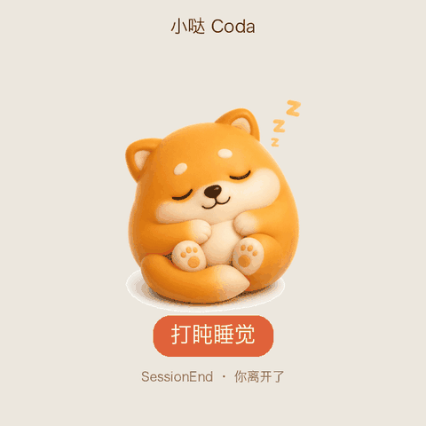

<p align="center">
  
</p>
<h1 align="center">小哒 Coda</h1>
<p align="center">
  <sub>替你把 AI 写的活儿盯到收尾的桌面小精灵。</sub>
</p>
<p align="center">
  <sub>基于 <a href="https://github.com/rullerzhou-afk/clawd-on-desk">clawd-on-desk</a> 二次开发 · 回车键队</sub>
</p>

<p align="center">
  
</p>

**小哒 Coda** 蹲在你的桌面上，实时盯着 AI 编码 Agent 在做什么 —— 发起一个长任务，转身去忙别的，等小哒告诉你「干完了」再回来。

你提问时它**思考**，工具运行时它**专注干活**，任务完成时它**欢呼**，出错时它**慌张**，你离开时它**打盹睡觉**。

> 支持 **Claude Code**、**Codex**、**Cursor** 等 20+ 主流 AI 编码 Agent。支持 Windows 11、macOS、Ubuntu/Linux。

---

## ✨ 核心功能

- **实时状态感知** —— 通过 hooks 感知 AI Agent 的活动（思考 / 干活 / 报错 / 完成 / 空闲），用动画即时反馈
- **5 种表情动画** —— 待机、思考、欢呼、报错、睡觉，跟着 Agent 状态自动切换
- **权限气泡** —— 工具权限请求以浮窗弹出，支持快捷键审批
- **会话仪表板** —— 同时监控多个 Agent 会话
- **移动伴侣（PWA）** —— 手机上实时镜像桌宠状态
- **多主题** —— 内置 **Coda**（小哒，暖橙 3D 小精灵，默认）等主题，支持自定义主题

---

## 🚀 快速开始

### 从源码运行

```bash
# 克隆仓库
git clone https://github.com/diaojz/coda-desktop.git
cd coda-desktop

# 安装依赖
npm install

# 启动（首次启动会自动注册 Claude Code 和 Codex 的 hooks）
npm start
```

启动后，小哒会浮在你的桌面上。**Claude Code** 和 **Codex CLI** 开箱即用（自动注册 hooks）；其他 Agent 在 **设置 → Agent 管理** 里按需安装集成。

> 默认界面语言为中文。

---

## 🎨 主题

内置主题 **Coda（小哒）** 为默认，是一只暖橙色的 3D 小精灵，5 种状态各有专属表情。主题文件位于 `themes/coda/`，可复制为模板创建自定义主题。

---

## 🙏 致谢

本项目基于开源项目 [clawd-on-desk](https://github.com/rullerzhou-afk/clawd-on-desk)（作者 Ruller_Lulu / 鹿鹿）二次开发。小哒 Coda 的形象与命名由「小宿科技全球黑客松 · 北京站」参赛队伍「回车键」原创。

---

## 📄 许可

源代码遵循 [GNU Affero General Public License v3.0](LICENSE)（AGPL-3.0）。

**艺术资源与主题素材（包括 `assets/` 和 `themes/*/assets/`）不在 AGPL-3.0 覆盖范围内**，版权归各自所有者所有：

- **小哒 Coda** 形象由「小宿科技全球黑客松 · 北京站」参赛队伍「回车键」原创。
- 原项目 **Clawd** 角色属于 [Anthropic](https://www.anthropic.com)，**Calico（三花猫）** 与 **Cloudling（云宝）** 艺术资源由鹿鹿（[@rullerzhou-afk](https://github.com/rullerzhou-afk)）创作，版权归原作者所有。
- 本项目为非官方粉丝项目，与 Anthropic、OpenAI 无关联，也未获其背书。
